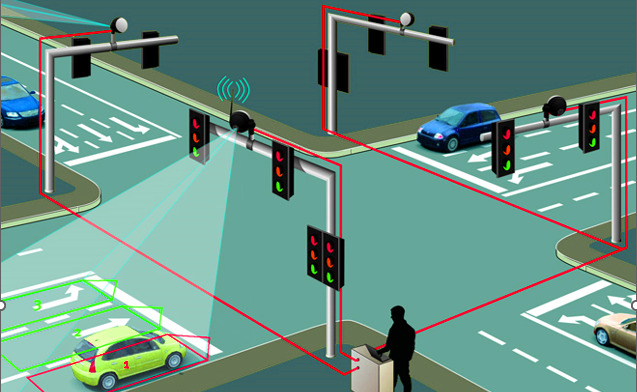

# Traffic Flow Optimization and Congestion Management Tool - S.A.D.A.K

This repository contains our solution for the Karnataka State Police Hackathon: "Datathon"
## Problem

Urban traffic congestion leads to economic losses, environmental impact, and decreased quality of life. Traditional traffic management methods are often limited in effectiveness.  

Problem Statement 1 - Evaluating the traffic congestion shown by map engine services against the calculated actual congestion using the Drone.

## Solution

The proposed solution is an object detection-based system using computer vision components.We leverage pre-trained models like YOLOv8 and supervision.These models can automatically detect and geo-reference bottlenecks and road congestions from images captured by the onboard cameras in real time, providing actionable insights for smooth and optimized traffic flow.
## Screenshots

