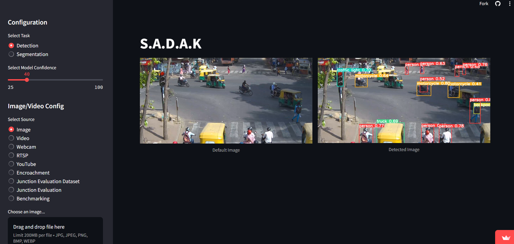
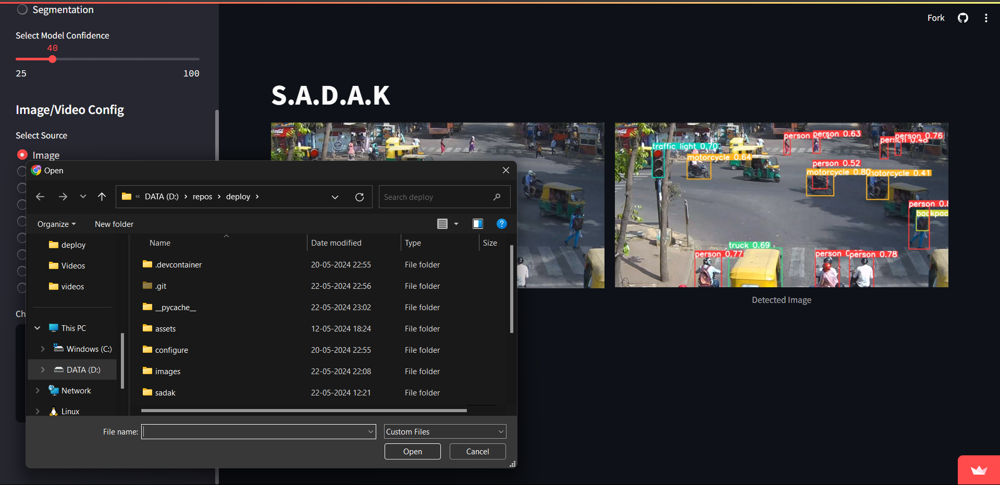
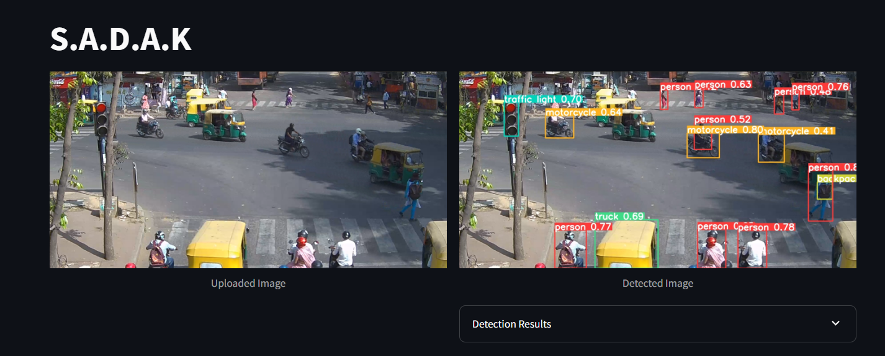
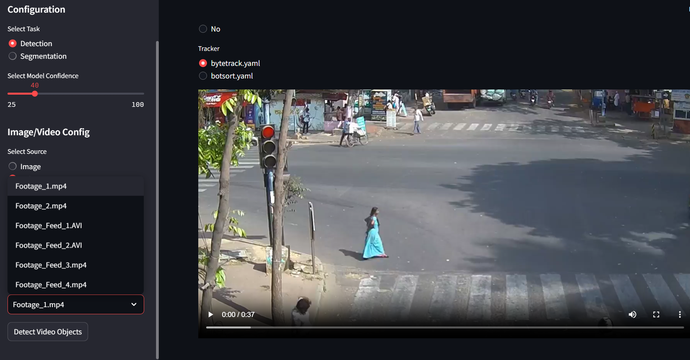

# Product link: https://sadakapp.streamlit.app/

# Traffic Flow Optimization and Congestion Management Tool - S.A.D.A.K

This repository contains our solution for the Karnataka State Police Hackathon: "Datathon"

## Problem

Urban traffic congestion leads to economic losses, environmental impact, and decreased quality of life. Traditional traffic management methods are often limited in effectiveness.  

- Sub-Problem Statement 1 - Evaluating the traffic congestion shown by map engine services against the calculated actual congestion using the Drone.
- Sub-Problem Statement 2 - Evaluating various junctions after optimal signal time is acheived.
- Sub-Problem Statement 3 - Detecting various bottlenecks and generating alerts in regard to them.

## Solution

The proposed solution is an object detection-based system using computer vision components.We leverage pre-trained models like YOLOv8 and supervision.These models can automatically detect and geo-reference bottlenecks and road congestions from images captured by the onboard cameras in real time, providing actionable insights for smooth and optimized traffic flow.


*Several Modules in this proposed solution still need to be worked upon

## Setup
- **Local Machine** :
  Clone the repository on to you local machine.
  Run the command in cmd -
  ```
  pip install -r requirements.txt
  ```
  The above ensure all the required dependecies are installed.

  Followed by -
  ```
  streamlit run app.py
  ```

  **In helper.py there's a function known as drawzones, having the repository cloned on local machine allows you to access it, just open helper.py and search for enchroachment function and uncomment the drawzones function.**
  
  
- **Web** :
  Just vist the product link mentioned at the start of the repository.

## Functions
- **Navigation** :
  The page consists of a main section along with a side bar, it is in this side bar that you can access numerous facilities provided by the product:
  - **Image Detection** - Detection of various objects in the image provide. This can be further extended to track number plates of various violators.
  - **Video Detection** - Detection of various objects in past videos to reconfirm claims made during real time footage.
  - **Webcam Detection** - This is a test feature to demonstrate the real time object detection capibilities of the project.
  - **RTSP Detection and Classification** - This takes in input as rtsp url of the source camera provided and provide detection analysis in real time.
  - **Youtube Detection and Classification** - Due to lack of rtsp urls we have created a feature to demonstrate the approach, just type in the source url of the youtube video you wish to see and it'll provide a detection analysis for the same in real time.
  - **Encroachment Identification and Alerts** - Integrating a custom trained model specificall on UAV imagae datasets and Indian vehicle dataset, the model identifies enchroachment and potential bottle necks in traffic and generate alerts to alert the respective authorities about the same.
  - **Junction Evaluation Dataset Generator**
  - **Junction Evaluator** - It evaluates the performance of the junction once optimal signal time is acheived.
  - **Benchmarking** - It evaluates the traffic congestion shown by map engine services against the calculated actual congestion using the drone to bring into perspective the accuracy of the maps.

 
  

## Screenshots

### Showing Image Detection
Images can have various objects detected within themselves with varying level of confidence, we can set the confidence level and look at the detection results.

#### Selecting an image


#### Result



### Showing Video Detection
Videos can have various objects detected within themselves with varying level of confidence, we can set the confidence level and look at the detection results.
#### Selecting a footage



#### Result
https://github.com/that-coding-kid/deploy/assets/120120491/f07bb3d4-3d74-468d-ac82-2682d6e00eda


### Webcam Detection
This is a test feature to demonstrate the real time object detection capibilities of the project.

https://github.com/that-coding-kid/deploy/assets/120120491/f425f00e-8ba8-42fe-a59d-5dd318c52270


### RTSP Detection
This takes in input as rtsp url of the source camera provided and provide detection analysis in real time.

#### Result


https://github.com/that-coding-kid/deploy/assets/120120491/85036508-7631-4531-9ad7-c591140f85df


### Youtube Detection
We have created a feature to demonstrate the approach, just type in the source url of the youtube video you wish to see and it'll provide a detection analysis for the same in real time. This works similar to rtsp feature.


### Bottleneck Dectection
Only the vehicles and other bottlenecks inside the marked areas are tracked, and a wait-time period is generated for them. If a vehicles stays within the marked area for longer than the permissible duration an alert is genrated for communicationg the control room.

#### Result

https://github.com/that-coding-kid/deploy/assets/120120491/f79faf0a-8d47-4dbe-8f6b-b6753c49196c


### Showing Real Time annotation for Traffic Density Estimation and congestion Evaluation
Videos are divided into further subclips which are used for dataset creation.  
We have limited the annotations to vehicles to limit the chances of False positives, this can be improved when scaled further.

### Result
#### Image

#### Video
https://github.com/that-coding-kid/deploy/assets/120120491/578aae1d-c878-41b0-9d5d-5b58823c25f0


